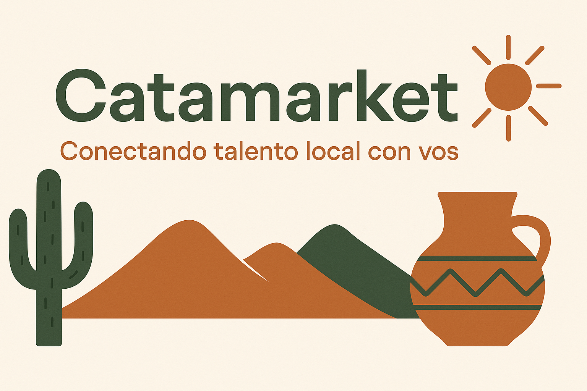

# Catamarket
**Plataforma de productos locales de Catamarca**  
Carrera: Tecnicatura Universitaria en Diseño de Software — Universidad Nacional de Catamarca  

## Descripción general  
CataMarket es una aplicación web orientada a emprendedores locales de Catamarca, que permite explorar productos y servicios agrupados por categorías, consultar precios y descubrir ofertas. El proyecto funciona como una SPA simulada, sin backend real; todos los datos e interacciones están preparados para demostración.

## Funcionalidades clave  
- Navegación por categorías de productos (Artesanías, Gastronomía, Indumentaria, Decoración, Servicios).  
- Filtrado de productos por categoría y por rango de precios (de menor a mayor y viceversa).  
- Búsqueda y filtrado de emprendedores según la categoría que ofrecen.  
- Visualización de productos destacados y ofertas especiales.  
- Perfil de emprendedor (nombre, productos y servicios ofrecidos).  
- Interfaz responsiva, adaptada a dispositivos móviles y escritorio.  

## Lógica y estructura técnica  
- Uso de **arrays y objetos** para almacenar productos, emprendedores, categorías y ofertas.  
- **Estructuras de control**: condicionales y bucles para gestionar filtros, visualización y navegación.  
- Modularización con funciones reutilizables para renderizado de productos, perfiles y listas filtradas.  
- **Paradigma orientado a eventos**: interacciones del usuario mediante clics y selección de filtros disparan funciones de actualización del DOM.  
- Simulación de estados dinámicos (como productos destacados, ofertas activas y filtros aplicados) sin base de datos externa.  
- Aplicación de **estilos y diseño visual** usando HTML5, CSS3 y Tailwind, garantizando una interfaz clara y moderna.  

## Tecnologías utilizadas  
- **HTML5**: Estructura de la web.  
- **CSS3 / Tailwind**: Estilos y diseño responsive.  
- **JavaScript**: Interactividad, filtrado, manipulación del DOM y lógica de navegación.  
- **Herramientas de desarrollo**: Git, GitHub, Visual Studio Code.  

## Enfoque del proyecto  
CataMarket busca ofrecer una experiencia intuitiva para que los usuarios puedan explorar productos y emprendedores locales de manera clara y rápida, destacando:  
- Acceso simple a categorías y ofertas.  
- Filtrado eficiente por precio y tipo de producto o emprendedor.  
- Interfaz visual limpia y responsiva, sin necesidad de registro ni backend.

## Relación académica (Programación I)

- Este proyecto refleja competencias clave abordadas en Programación I, tales como:

- Fundamentos de la lógica de programación y resolución de problemas.

- Uso de estructuras de control (condicionales, bucles) y estructuras de datos (arrays, objetos, JSON).

- Modularización y reutilización de código mediante funciones.

- Aplicación del paradigma orientado a eventos para interacciones dinámicas con el usuario.

- Comprensión y manipulación de datos en memoria sin necesidad de base de datos externa.

El proyecto demuestra la implementación práctica de los conceptos esenciales de Programación I, validando competencias tanto conceptuales como procedimentales adquiridas durante la formación académica.
